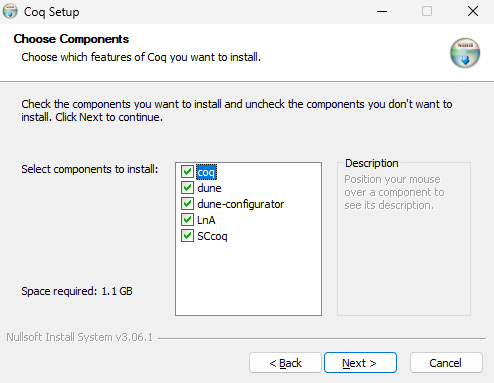

# Roqc-lna README

This repository is created for the Radboud University Computing Science course 'Logic and Applications' to create a Rocq environment where the tactics match as closely as possible to logical rules taught in this course.

## Installation guide

This guide is written to use [Visual Studio Code] (VS Code) as an editor. If you prefer not to send any telemetry, [VSCodium] should work, just replace all instances of `code` in this guide with `codium`.

1. First make sure you have a working installation of [Visual Studio Code].
2. Check if the editor is added to the PATH environment variable by opening a shell (eg. using Terminal, Powershell, etc) of your choice and running `code -v`. This should look similar to the following, the version may differ:

   

   - If you have a working installation of VS Code, but `code -v` does not work, you might have to add the installation directory to your PATH environment variable.

3. Next we will install `vscoq-language-server` and our `LnA` package:

   - Windows users can do this by downloading the file called ` LnA-windows-installer.exe` from our [latest release] page.
     DO NOT CHANGE THE INSTALLATION LOCATION. For more information on using this installer, got to the [dedicated section](#using-the-installer-for-windows-users) for using the installer on this page.

   - Linux and Apple users can manually install the prerequisite packages through `opam`.

     1. Apple users only: install `gpatch` using `brew install gpatch`
     2. Install `opam` from the package manager of your choice, for example for Apple users:

        ```shell
        brew install opam
        ```

        or

        ```shell
        apt install opam
        ```

        etc.

     3. Install vscoq-language-server version 2.2.1 through opam by running
        ```shell
        opam pin add -y vscoq-language-server.2.2.1 https://github.com/coq-community/vscoq/releases/download/v2.2.1/vscoq-language-server-2.2.1.tar.gz
        ```
     4. Download and install our custom LnA library through opam by running
        ```shell
        opam pin add -y LnA https://github.com/logic-and-applications/rocq-lna/releases/download/v0.0.1/LnA-0.0.1.tar.gz
        ```

4. Install the [`vscoq`] extension.

   - Optionally, this can be done through a shell by running

     ```shell
     code --install-extension maximedenes.vscoq
     ```

   - Opening VS Code with this extension active for the first time will probably throw up the following error message, ignore it.
     
     Click it away by pressing `Cancel` and proceed to the next step, where we will solve it.

5. To make `vscoq` able to function, we will add the path to the installed location of `vscoqtop` to the User Settings of the extension:

   1. Find the path to `vscoqtop`. For Windows users using the installer this will be

      ```
      "C:\\cygwin_LnA\\home\\runneradmin\\.opam\\LnA\\bin\\vscoqtop"
      ```

      Otherwise, you can find it by running

      ```shell
      which vscoqtop
      ```

      on unix machines with opam added to the PATH environment correctly.

   2. Add this path to the `path` setting of `vscoq` (press ctrl+shift+P in VS Code and type "User Settings (JSON)", then hit Enter). Saving this file will save the setting.
      ```json
      {
         "vscoq.path": "C:\\cygwin_LnA\\home\\runneradmin\\.opam\\LnA\\bin\\vscoqtop"
         ...there may be other options
      }
      ```
   3. Close and re-open VS Code. The extension should now work for any `.v` file.

6. Download and install our custom VS Code extension: `LnA-VS-code`.

   1. Go to the [latest release]
   2. Download the `LnA-vscode-extension-0.0.1.vsix` file
   3. Navigate to the location of the downloaded file in a shell (for example by navigating to it in explorer and right clicking in the folder on the `Open in Terminal` option) and run

      ```shell
      code --install-extension LnA-vscode-extension-0.0.1.vsix
      ```

If everything worked, you should now be able to open one of our exercises and step through the file using `Alt+DownArrow`, or to the cursor using `Alt+RightArrow`. A second window should open to the right, and it should look similar to the following image:


### Using the Installer for Windows Users

Windows users can download our custom installer from our [latest release] page. DO NOT CHANGE THE INSTALLATION DIRECTORY!

1. We have not signed the installer, so windows will give a warning that the application about to be installed is not recognized:

   

   Ignore this warning by clicking `More info` and `Run anyway`

   

2. Allow the installer to make changes on your device by clicking `Yes` to enter the installation wizard. Then click past the start and agree to Rocq's user license agreement.
3. Next you may choose which components to install. Of these, only `coqide` is not required for the course. If you do not want `coqide`, uncheck it and click `Next`.

   `coqide` is a dedicated ide created for Rocq. You may choose to use this during the course, but it does not provide some of the custom the functionality of our VS Code extension or ProofWeb. To be sure your exercise is allowed for this course, you can copy the file to ProofWeb and check there.
   

4. DO NOT CHANGE THE INSTALLATION DIRECTORY! Changing the installation directory can have various strange side effects and will likely not work. Simply click `Install` at this step.
   
5. Continue with step 4 from the [Installation Guide](#installation-guide).

<!-- Links -->

[Visual Studio Code]: https://code.visualstudio.com/download
[VSCodium]: https://github.com/VSCodium/vscodium/releases
[`vscoq`]: https://marketplace.visualstudio.com/items?itemName=maximedenes.vscoq
[latest release]: https://github.com/logic-and-applications/rocq-lna/releases/latest
