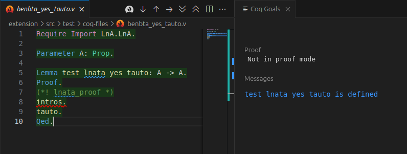

# Rocq-LnA README

This repository is created for the Radboud University Computing Science course 'Logic and Applications'. The goal of it is to create a Rocq environment where the tactics match as closely as possible to logical rules taught in this course.

Rocq-LnA provides 2 features to achieve this, a Rocq library and a Visual Studio Code (VS Code) extension.

### LnA package

The custom Rocq package is simply called LnA. It provides a set of tactics which are made to match the logical rules taught in the course as closely as possible. During the course, tasks will allow or disallow only a specific subset of this set.

### LnA-vscode-extension

The custom VS Code extension is built to provide immediate feedback on which tactics are used when they are not supposed to be. It uses special comment blocks, like `(*! benbta_proof *)`, to distinguish which set of tactics should be allowed. Only tactics _after_ the special comment blocks are checked, so be sure to only work after these blocks.

It is an offline extension with no reference to an original document, so be careful not to change these comment blocks or the premise of a `Lemma` or `Theorem`. Doing this will not cause the extension to create a warning or error in VS Code, but it will be caught by ProofWeb when handing it in. You can always check in ProofWeb if the final result is valid by clicking `File > Load` and looking for the icon in front of the task. An orange flag in front of the task means tactics were used that are not allowed. You can inspect which tactics and where by clicking on the question mark button after the task.

# Installation guide

This guide is written to use [Visual Studio Code] (VS Code) as an editor. If you prefer not to send any telemetry, [VSCodium] should work, just replace all instances of `code` in this guide with `codium`. Check the [Troubleshooting section](#troubleshooting) if any problems occur.

1. Install `vscoq-language-server` and our `LnA` package in one of the following ways:

   - Windows users can do this by downloading the file called ` LnA-windows-installer.exe` from our [latest release] page.
     DO NOT CHANGE THE INSTALLATION LOCATION. For more information on using this installer, got to the [dedicated section](#using-the-installer-for-windows-users) for using the installer on this page.

   - Linux and Apple users can manually install the prerequisite packages through `opam`.

     1. Apple users only: ensure [homebrew](https://brew.sh/) is installed.
     2. Install [`opam`] from the package manager of your choice, for example for Apple users:

        ```shell
        brew update
        brew install opam
        ```

        or

        ```shell
        sudo apt update
        sudo apt install opam
        ```

        etc.

     3. Check if opam is at least version `2.1.0` by running

        ```shell
        opam --version
        ```

        If it is not, consider upgrading your operating system to get a more recent package repository, as this will probably happen for other courses in the future too. Alternatively, go to the [associated troubleshooting section](#when-the-installed-opam-version-is-lower-than-210) to install a more recent version.

     4. Initialize opam and its dependencies by running
        ```shell
        opam init
        ```
        and completing the process by answering any questions.
     5. Add the opam environment to the current shell by running
        ```shell
        eval $(opam env)
        ```
        - running this should give no output
     6. Download and install our custom LnA library and its dependencies through opam by running:
        ```shell
        opam pin add -y LnA https://github.com/logic-and-applications/rocq-lna/releases/download/v1.0.0/LnA-1.0.0.tar.gz
        ```
        - The `-y` flag answers `yes` to the question if the versions to install are correct (and most other questions that may arise)
        - This step may take a while (+10 min). You can move on with the next steps. the VsCoq extension will not function until this step finishes, so ignore errors that look like:
          

2. Download and install our custom VS Code extension: `LnA-VS-code`.

   1. First make sure you have a working installation of [Visual Studio Code] and check if the editor is added to the PATH environment variable. Do this by opening a shell (eg. using Terminal, Powershell, etc) of your choice and running `code -v`. This should look similar to the following, the version may differ:

      

      - If you have a working installation of VS Code, but `code -v` does not work, you might have to add the installation directory to your PATH environment variable.
      - Apple users can add VS Code to their PATH using [these instructions](https://code.visualstudio.com/docs/setup/mac#_launching-from-the-command-line).

   1. Download the [`LnA-vscode-extension-1.0.0.vsix`] file

   1. Navigate to the location of the downloaded file in a shell (for example by navigating to it in explorer and right clicking in the folder on the `Open in Terminal` option) and run

      ```shell
      code --install-extension LnA-vscode-extension-1.0.0.vsix
      ```

      - Since our extension is dependent on the [VsCoq] extension, this should be downloaded automatically as well. If it is not in the list of extensions in the `Extensions` tab in the left Activity Bar, you can install it manually by running
        ```shell
        code --install-extension maximedenes.vscoq
        ```

If everything worked, you should now be able to download or copy [the test file] in a [trusted workspace](https://code.visualstudio.com/docs/editor/workspace-trust) to enable extensions. Open the file and step through the file using `Alt+DownArrow`, or to the cursor using `Alt+RightArrow`. A second window should open to the right, and it should look similar to the following image:



If does not work, check the [Troubleshooting section](#troubleshooting)  for a possible solution.

### Using the Installer for Windows Users

Windows users can download our custom installer from our [latest release] page. DO NOT CHANGE THE INSTALLATION DIRECTORY!

1. We have not signed the installer, so windows will give a warning that the application about to be installed is not recognized:

   

   Ignore this warning by clicking `More info` and `Run anyway`

   

2. Allow the installer to make changes on your device by clicking `Yes` to enter the installation wizard. Then click past the start and agree to Rocq's user license agreement.
3. Next you may choose which components to install.

   

4. DO NOT CHANGE THE INSTALLATION DIRECTORY! Changing the installation directory can have various strange side effects and will likely not work. Simply click `Install` at this step.

   

5. Continue with step 2 from the [Installation Guide](#installation-guide).

## Troubleshooting

### When `code -v` opens VS Code instead of displaying a version

This is a strange bug that occurs when VS Code's PATH environment variable points to code.exe directly, instead of the \bin subdirectory that points to it. You will need to change this entry.
(see https://stackoverflow.com/questions/78157066/why-doesnt-the-code-help-command-display-help-in-command-prompt)

### VsCoq throws an error that `vscoq-language-server` is not installed
If you see the following error:

This means VsCoq cannot find the path to the vscoq-language-server location. First try simply restarting VS Code, the extension only searches for the location when starting the extension. If that does not work, you can enter the location manually by taking the following steps:

1. Find the path to `vscoqtop`. For Windows users using the installer this will be

   ```
   "C:\\cygwin_LnA\\home\\runneradmin\\.opam\\LnA\\bin\\vscoqtop"
   ```

   Otherwise, you can find it by running

   ```shell
   which vscoqtop
   ```

   on unix machines with opam added to the PATH environment correctly.

2. Add this path to the `path` setting of `vscoq` (Open VS Code, then press Ctrl/Cmd+Shift+P and type "User Settings (JSON)", then hit Enter). Saving this file will save the setting.
   ```json
   {
      "vscoq.path": "C:\\cygwin_LnA\\home\\runneradmin\\.opam\\LnA\\bin\\vscoqtop.exe"
      ...there may be other options
   }
   ```
3. Close and re-open VS Code. 

### When there are dependency conflicts when installing `opam pin add LnA`

You may need a more recent version of `opam`. Upgrading opam is not always the easiest process, but we found that deleting the entire opam directory before installing a newer version using step 3.3 usually works.

### When coq files are highlighted, but the `Coq Goals` screen does not appear

This can have multiple causes.

- Check if the `vscoq.path` setting is a valid path to the `vscoqtop` file. To find the settings you can search for VsCoq in the left activity bar, then click the little `manage` gear and click on Settings. The path to your `vscoqtop` should be displayed in the `VsCoq: Path` setting. Changing this path will only take effect after fully closing and re-opening VS Code.
- VsCoq does not work with invalid Rocq file names, so check that the file name is a valid Rocq file name. Rocq file names must end in `.v` and cannot have special characters other than `-`.

### When the `intros` tactic in the test file is not highlighted red

Check first if both the `LnA-vscode-extension` and the `VsCoq` extensions visible in the `Extensions` tab on the left Activity Bar. If they are and VsCoq is functioning, see if the file you are using matches [the test file] exactly, and the `intros` tactic is not above the `(*! benbta_proof *)` comment, as that will disable the check. Finally, fully closing and re-opening VS Code might fix the problem.

### When the installed `opam` version is lower than 2.1.0

If installing `opam` with `apt` or `brew` gives a version that is too old, you need to install opam using the following script from the [opam installation guide](https://opam.ocaml.org/doc/Install.html):

```shell
bash -c "sh <(curl -fsSL https://opam.ocaml.org/install.sh)"
```

This will not install all the dependencies, so you might also need to install them by running

```shell
sudo apt install bzip2 rsync make bubblewrap gcc git patch unzip curl
```

### When the latest version of `vscoq-language-server` provided by opam is less then 2.2.3

The VS Code extension requires new features provided in version 2.2.3 of `vscoq-language-server`. If installing the LnA library or installing it manually gives an error that this version cannot be found, you probably need to update your opam repository by running 
```shell
opam upgrade
```
After this you can retry installing `vscoq-language-server` by running 
```shell
opam install vscoq-language-server.2.2.3
```
or re-running the installation script for installing the LnA library:
```shell
opam pin add -y LnA https://github.com/logic-and-applications/rocq-lna/releases/download/v1.0.0/LnA-1.0.0.tar.gz
```


## Installing custom packages

You may find that you want to explore Rocq's capabilities beyond the scope of this course. If you do, here are some instructions of how to install additional packages that are not used in this course. If you do, here is some help on how to do that if you installed Rocq using our instructions:

### Installing custom packages after having used the Windows installer

Our installer provides a very minimal set of packages. If you don't need the library provided for this course, your best course of action is probably to use the latest [Rocq Platform binary installer](https://rocq-prover.org/install#windows). If you do need custom libraries like ours, follow [these instructions](https://github.com/coq/platform/blob/2024.10.1/doc/README_Windows.md#installation-by-compiling-from-sources-using-scripts--opam) to create a Cygwin installation to create an environment where you can use `opam` just like Linux or Mac users.

### Installing custom packages with `opam`

If you used `opam` to install the LnA package, you can similarly install other packages the same way, or by using `opam install`. Suppose you want to install the [`coq-iris`] package. If you do this for the first time, you will need to add the Coq opam repository first:

```shell
opam repo add coq-released https://coq.inria.fr/opam/released
```

This will make a [large collection](https://github.com/coq/opam/tree/master/released/packages) of coq packages available to install. Next you can install the package by running

```shell
opam install coq-iris
```

Packages that are not available through this repository will either likely provide their own instructions or you will have to install the package the same way we did with the LnA package, with `opam pin add <archive/github link of package>`.

<!-- Links -->

[Visual Studio Code]: https://code.visualstudio.com/download
[VSCodium]: https://github.com/VSCodium/vscodium/releases
[VsCoq]: https://marketplace.visualstudio.com/items?itemName=maximedenes.vscoq
[latest release]: https://github.com/logic-and-applications/rocq-lna/releases/latest
[`opam`]: https://opam.ocaml.org/doc/Install.html
[`coq-iris`]: https://gitlab.mpi-sws.org/iris/iris
[the test file]: https://github.com/logic-and-applications/rocq-lna/blob/main/extension/src/test/coq-files/benbta_yes_tauto.v
[`LnA-vscode-extension-1.0.0.vsix`]: https://github.com/logic-and-applications/rocq-lna/releases/download/v1.0.0/lna-vscode-extension-1.0.0.vsix
